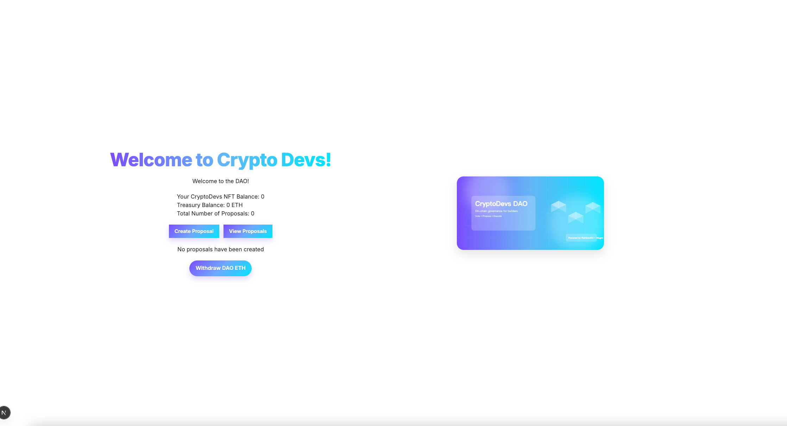

## Foundry

**Foundry is a blazing fast, portable and modular toolkit for Ethereum application development written in Rust.**

Foundry consists of:

- **Forge**: Ethereum testing framework (like Truffle, Hardhat and DappTools).
- **Cast**: Swiss army knife for interacting with EVM smart contracts, sending transactions and getting chain data.
- **Anvil**: Local Ethereum node, akin to Ganache, Hardhat Network.
- **Chisel**: Fast, utilitarian, and verbose solidity REPL.

## Documentation

https://book.getfoundry.sh/

## Usage

### Build

```shell
$ forge build
```

### Test

```shell
$ forge test
```

### Format

```shell
$ forge fmt
```

### Gas Snapshots

```shell
$ forge snapshot
```

### Anvil

```shell
$ anvil
```

### Deploy

```shell
$ forge script script/Counter.s.sol:CounterScript --rpc-url <your_rpc_url> --private-key <your_private_key>
```

### Cast

```shell
$ cast <subcommand>
```

### Help

```shell
$ forge --help
$ anvil --help
$ cast --help
```

demo from :https://learnweb3.io/courses/sophomore/build-an-nft-collection-with-a-whitelist-using-foundry-and-solidity/


source .env

forge create src/Whitelist.sol:Whitelist --rpc-url "$QUICKNODE_RPC_URL" --private-key "$PRIVATE_KEY" --constructor-args 10 --verify --etherscan-api-key "$ETHERSCAN_API_KEY"

forge create --rpc-url "$QUICKNODE_RPC_URL" --private-key "$PRIVATE_KEY" --broadcast --verify --etherscan-api-key "$ETHERSCAN_API_KEY" src/CryptoDevs.sol:CryptoDevs --constructor-args 0xD1Bf5C82aFCB93A6B8a347b44D0CCe730132e541


## Project Status (English Summary)

- Foundry project is set up with OpenZeppelin Contracts (installed as a git submodule under lib/openzeppelin-contracts).
- Contracts implemented:
  - Whitelist.sol — manages whitelist addresses and max count (constructor takes uint8 maxWhitelistedAddresses).
  - CryptoDevs.sol — ERC721Enumerable + Ownable NFT collection with:
    - Price: 0.01 ETH per token (public sale).
    - Max supply: 20.
    - Whitelist integration: reservedTokens equals whitelist.maxWhitelistedAddresses().
    - Whitelisted addresses can mint without paying the full price (send 0 ETH or less than 0.01 ETH); non-whitelisted must send >= 0.01 ETH.
    - Owner-only withdraw() to collect contract ETH.
- Compiler and config:
  - foundry.toml uses solc_version = 0.8.20 (compatible with OpenZeppelin ^0.8.20).
- Deployment (Sepolia):
  - Whitelist deployed and verified: 0xD1Bf5C82aFCB93A6B8a347b44D0CCe730132e541.
  - CryptoDevs ready to deploy using the Whitelist address above.

## Intended Workflow

1) Prepare environment
- Create a .env file with:
  - QUICKNODE_RPC_URL (Sepolia RPC)
  - PRIVATE_KEY (deployer) — keep secret; do not commit
  - ETHERSCAN_API_KEY (optional, for verification)

2) Deploy Whitelist
- Example (already done):
  forge create src/Whitelist.sol:Whitelist --rpc-url "$QUICKNODE_RPC_URL" --private-key "$PRIVATE_KEY" --constructor-args 10 --verify --etherscan-api-key "$ETHERSCAN_API_KEY"

3) Deploy CryptoDevs (pass Whitelist address)
- Example:
  forge create --rpc-url "$QUICKNODE_RPC_URL" --private-key "$PRIVATE_KEY" --broadcast --verify --etherscan-api-key "$ETHERSCAN_API_KEY" src/CryptoDevs.sol:CryptoDevs --constructor-args 0xD1Bf5C82aFCB93A6B8a347b44D0CCe730132e541

4) Mint NFTs
- Whitelisted address (free/gas-only mint):
  cast send $CRYPTODEVS_ADDRESS "mint()" --rpc-url "$QUICKNODE_RPC_URL" --private-key "$PRIVATE_KEY" --value 0
- Public mint (non-whitelisted must pay 0.01 ETH):
  cast send $CRYPTODEVS_ADDRESS "mint()" --rpc-url "$QUICKNODE_RPC_URL" --private-key "$PRIVATE_KEY" --value 10000000000000000

5) Read contract state
- Total supply:
  cast call $CRYPTODEVS_ADDRESS "totalSupply()(uint256)" --rpc-url "$QUICKNODE_RPC_URL"
- Reserved tokens:
  cast call $CRYPTODEVS_ADDRESS "reservedTokens()(uint256)" --rpc-url "$QUICKNODE_RPC_URL"
- Reserved tokens claimed:
  cast call $CRYPTODEVS_ADDRESS "reservedTokensClaimed()(uint256)" --rpc-url "$QUICKNODE_RPC_URL"
- Price:
  cast call $CRYPTODEVS_ADDRESS "_price()(uint256)" --rpc-url "$QUICKNODE_RPC_URL"

6) Withdraw funds (owner only)
- Send all contract ETH to owner:
  cast send $CRYPTODEVS_ADDRESS "withdraw()" --rpc-url "$QUICKNODE_RPC_URL" --private-key "$PRIVATE_KEY"

## Notes
- Always use --broadcast to actually send transactions; without it, some commands may only simulate.
- Ensure RPC, chain, and API keys are consistent across deploy and verify steps.
- Keep PRIVATE_KEY and any secrets out of version control.
- If local Anvil RPC encounters proxy/network restrictions, prefer deploying to Sepolia via a trusted RPC.


https://learnweb3.io/courses/sophomore/build-an-nft-powered-fully-on-chain-dao-to-invest-in-nft-collections-as-a-group/

```
forge create --rpc-url "$QUICKNODE_RPC_URL" --private-key "$PRIVATE_KEY" --broadcast --verify --etherscan-api-key "$ETHERSCAN_API_KEY" src/CryptoDevsNFT.sol:CryptoDevsNFT 
```
```
forge create --rpc-url "$QUICKNODE_RPC_URL" --private-key "$PRIVATE_KEY" --etherscan-api-key "$ETHERSCAN_API_KEY" --verify --broadcast src/FakeNFTMarketplace.sol:FakeNFTMarketplace
```

https://sepolia.etherscan.io/address/0x4270f449f91d0f194c2491e77ce5f93f1a96e617


```
forge create --rpc-url "$QUICKNODE_RPC_URL" --private-key "$PRIVATE_KEY" --broadcast src/CryptoDevsDAO.sol:CryptoDevsDAO --constructor-args 0x4270F449f91d0f194c2491e77cE5f93F1A96E617 0xD83966Be9876C05583E8955d0aa248dc2f0a184f 
```

## Deploy details（Sepolia）

- Deployer: 0xD95442c30E1dfB7f4b1c519629200A6f2A40546E
- CryptoDevsNFT 地址: 0xD83966Be9876C05583E8955d0aa248dc2f0a184f
- FakeNFTMarketplace 地址: 0x4270F449f91d0f194c2491e77cE5f93F1A96E617
- CryptoDevsDAO 地址: 0xeC01b978378846650b0c9C1DB5fd39e21AB0DdD3
- CryptoDevsDAO 交易哈希: 0x8bc5ae1c67e6239437ac804d8763bd358fe0345230c26f880954e1a189544f4a

Etherscan 链接：
- FakeNFTMarketplace: https://sepolia.etherscan.io/address/0x4270f449f91d0f194c2491e77ce5f93f1a96e617
- CryptoDevsNFT: https://sepolia.etherscan.io/address/0xd83966be9876c05583e8955d0aa248dc2f0a184f
- CryptoDevsDAO: https://sepolia.etherscan.io/address/0xec01b978378846650b0c9c1db5fd39e21ab0ddd3

### Preview


